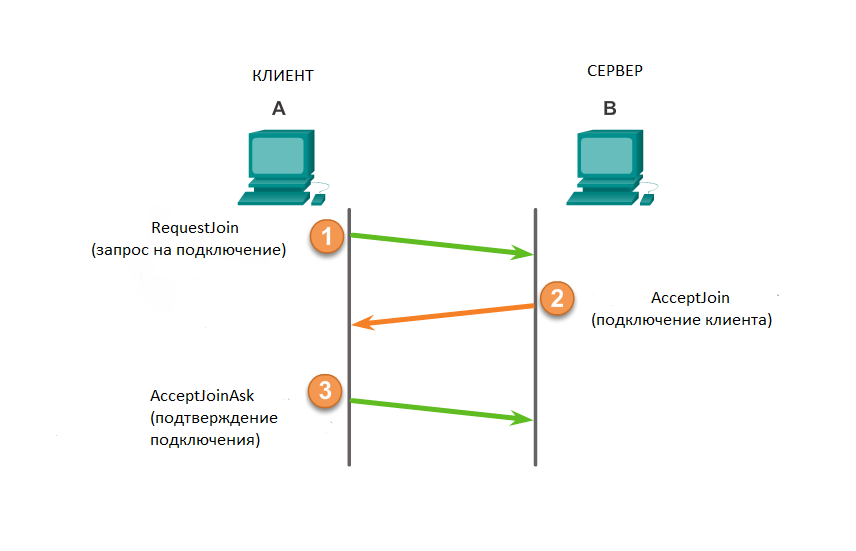

# Документация к проекту
Данный проект включает в себя серверную и клиентскию часть игры Пинг-Понг написанную на сокетах.


# Оглавление

- **Глава I**

  - [Пакет](#Пакет)
  - [Установление соединения](#Установление-соединения)

- **Заключение**

  - [Библиотеки](#Библиотеки)

 
# Пакет

Первые 4 байта отдаются _PacketType_, который указывает на тип пакета.
Следующие 8 байт выделяются для _timestamp_ - это время отправленного пакета. После
этого следует массив _data_ с информацией, которую мы захотим загрузить (к примеру
массив массивов топ 10). В итоге получается, что минимальный размер пакета может составлять
4+8=12 байт.

```c#
public class Packet
{
  public byte[] data = new byte[0];  //data that is used as an answer to someone
  public long timestamp; //time when packet was created
  public PacketType type; //type of packet
}
```
## Типы пакетов (PacketType)

Как видно у пакетов есть тип, который будет помогать с определением действий сервера или
клиента.

```c#
public enum PacketType : uint
{
  AcceptJoin = 1,
  IsHereAck, //server acknowledges client`s state
  GameStart,
  GameState,
  GameEnd = 5,
  //!server
  RequestJoin = 6,
  IsHere,
  JoinAck,
  GameStartAck,
  PaddlePosition //position of paddle
}
```
## Реализация пакетов
- **Серверные**
  - [AcceptJoin](#AcceptJoin)
  - [IsHereAck](#IsHereAck)
  - [GameStart](#GameStart)
  - [GameState](#GameState)
- **Клиентсие**
  - RequestJoin
  - IsHere
  - JoinAck
  - GameStartAck
  - PaddlePosition
- **Другие**
  - [GameEnd](#GameEnd)

### AcceptJoin
AcceptJoin – сервер отправляет клиенту в ответ на запрос о подключении. Содержит в себе информацию о стороне игрока (левый/правый).
```c#
public class AcceptJoin : Packet
    {
        // Paddle side
        public PaddleSide Side
        {
            get { return (PaddleSide)BitConverter.ToUInt32(data, 0); }
            set { data = BitConverter.GetBytes((uint)value); }
        }

        public AcceptJoin() : base(PacketType.AcceptJoin)
        {
            data = new byte[sizeof(PaddleSide)];
            Side = PaddleSide.None; //default value
        }
        public AcceptJoin(byte[] bytes) : base(bytes) { }
    }
 ```
### IsHereAck
IsHereAck – сервер отправляет клиенту, для подтверждения, что клиент все еще подключен.
```c#
 public class IsHereAck : Packet
    {
        public IsHereAck() : base(PacketType.IsHereAck) { }
    }
```
### GameStart
GameStart – сервер отправляет клиенту для уведомления последнего о начале игры.
```c#
public class GameStart : Packet
    {
        public GameStart() : base(PacketType.GameStart) { }
    }
```
### GameStatePacket
GameStatePacket – сервер передает клиенту положение мяча, палочек и счет.
```c#
public GameStatePacket()
            : base(PacketType.GameState)
        {
            // Allocate data for the payload (we really shouldn't hardcode this in...)
            data = new byte[24];

            // Set default data
            LeftY = 0;
            RightY = 0;
            BallPosition = new Vector2();
            LeftScore = 0;
            RightScore = 0;
        }
```
### GameEnd
GameEnd – отправляет сервер клиенту или наоборот, чтобы уведомить другого игрока, что игра окончена.
```c#
public class EndGame : Packet
    {
        public EndGame() : base(PacketType.GameEnd) { }
    }
```
# Установление соединения
- Клиент запрашивает подключение. 
- Сервер отвечает согласием и передает игровую сторону клиента (право/лево). 
- Клиент отвечает, что получил пакет с установленной для него стороной игры.

# Библиотеки
## Не забыть добавить в visual studio в расширениях monogame template extension
- Newtonsoft.Json _Используется для БД_ [ссылка](https://www.nuget.org/packages/Newtonsoft.Json)
- MonoGame.Desktop 3.5 _Используется для игрового движка_ [ссылка](https://www.nuget.org/packages/MonoGame.Framework.DesktopGL)
